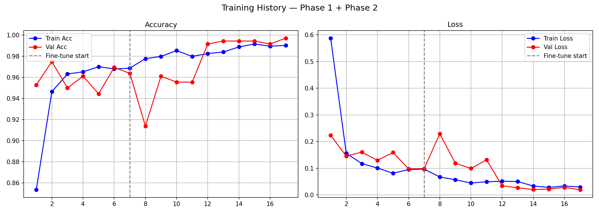

# 🔩 Metal Defect Detection System

An ML-based computer vision system that automatically detects 
and classifies defects in metal surfaces using deep learning.

## 📸 Training Results


## 🎯 What it does
- Detects surface defects in metal components
- Classifies defect types using a trained deep learning model
- Automates quality control inspection process


## 🛠 Tech Stack
- Python, PyTorch
- OpenCV, scikit-learn
- NumPy, Matplotlib

## 🚀 How to Run

**Install dependencies**
```bash
pip install torch torchvision opencv-python scikit-learn matplotlib
```

**Run detection**
```bash
python app.py
```

**Train from scratch**
```bash
python train.py
```

## 📊 Model Details
- Framework: PyTorch
- Task: Metal surface defect classification
- Output: Defect type + confidence score

## 💡 What I learned
- Training custom CNN models with PyTorch
- Annotation conversion pipelines
- Deploying trained `.pth` models for inference
